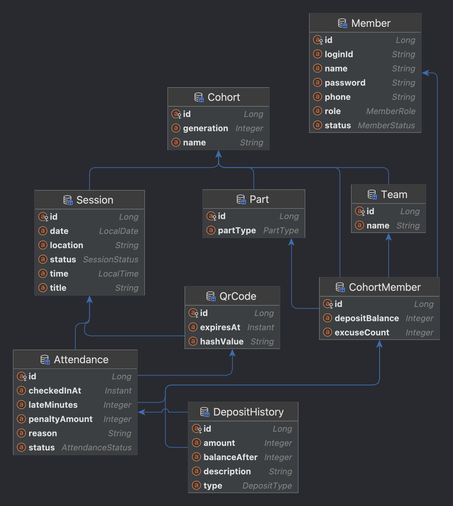

# 프로그라피 11기 백엔드 과제

출결 관리 시스템 백엔드 API 서버입니다.

## 목차

- [프로젝트 소개](#프로젝트-소개)
- [기술 스택](#기술-스택)
- [개발 환경 구성 및 실행 방법](#개발-환경-구성-및-실행-방법)
- [API 문서](#주요-api-엔드포인트-)
- [ERD](#erd)
- [시스템 아키텍처](#시스템-아키텍처)
- [문서 모음](#문서-모음)

---

## 프로젝트 소개

프로그라피 11기 리크루팅을 위한 과제입니다.
동아리원들의 출결과 일정을 관리합니다.

### 구현 기능 (필수 16개)

- 회원 관리 (등록, 조회, 수정, 탈퇴, 대시보드)
- 기수 관리 (목록 조회, 상세 조회)
- 일정 관리 (세션 생성, 조회, 수정, 취소)
- QR 코드 (생성, 갱신)
- 로그인

---

## 기술 스택

### Backend
- **Java** 17
- **Spring Boot** 4.0.3
- **Spring Data JPA**
- **Spring Security** (BCrypt 비밀번호 암호화)

### Database
- **H2 Database** (In-memory)

### Build Tool
- **Gradle** 

### Test
- **JUnit 5**
- **Mockito**

---

## 개발 환경 구성 및 실행 방법

### 1. 사전 요구사항

먼저 다음 환경이 설치되어 있어야 합니다.

- **JDK 17 이상**
- **Gradle**
- **Git**

### 2. 프로젝트 클론
```bash
git clone https://github.com/your-username/prography_assignment.git
cd prography_assignment
```

### 3. 빌드

프로젝트 루트 디렉토리에서 실행합니다.

#### Gradle Wrapper 사용 (권장)
```bash
./gradlew clean build
```

#### 로컬 Gradle 사용
```bash
gradle clean build
```
빌드가 성공하면 `build/libs/` 디렉토리에 JAR 파일이 생성됩니다.

### 4. 애플리케이션 실행

#### 방법 1: Gradle로 실행 (개발 환경)
```bash
./gradlew bootRun
```

#### 방법 2: JAR 파일로 실행 (프로덕션)
```bash
java -jar build/libs/prography_assignment-0.0.1-SNAPSHOT.jar
```

### 5. Port
기본 포트는 **8080**입니다.

브라우저에서 확인:
```
http://localhost:8080
```

### 6. H2 Database 콘솔 접속 (개발용)

H2 인메모리 데이터베이스 콘솔에 접속할 수 있습니다.
```
http://localhost:8080/h2-console
```

**접속 정보:**
- **JDBC URL:** `jdbc:h2:mem:prography`
- **User Name:** `sa`
- **Password:** `(없음)`

### 7. 시드 데이터 확인

서버 시작 시 자동으로 다음 데이터가 생성됩니다:

- **관리자 계정:** `admin` / `admin1234`
- **기수:** 10기, 11기 (현재 기수: 11기)
- **파트:** SERVER, WEB, iOS, ANDROID, DESIGN
- **팀:** Team A, Team B, Team C

### 8. 테스트 실행

전체 테스트를 실행하려면:
```bash
./gradlew test
```

---

### 주요 API 엔드포인트 

#### 인증
- `POST /api/v1/auth/login` - 로그인

#### 회원 관리
- `POST /api/v1/members` - 회원 등록
- `GET /api/v1/members/{id}` - 회원 조회
- `PUT /api/v1/members/{id}` - 회원 수정
- `DELETE /api/v1/members/{id}` - 회원 탈퇴
- `GET /api/v1/admin/members/dashboard` - 회원 대시보드

#### 일정 관리
- `POST /api/v1/admin/sessions` - 일정 생성
- `GET /api/v1/admin/sessions` - 일정 목록 조회 (관리자)
- `GET /api/v1/sessions` - 일정 목록 조회 (회원)
- `PUT /api/v1/admin/sessions/{id}` - 일정 수정
- `DELETE /api/v1/admin/sessions/{id}` - 일정 취소

#### QR 코드
- `POST /api/v1/admin/sessions/{sessionId}/qrcodes` - QR 코드 생성
- `PUT /api/v1/admin/qrcodes/{id}/renew` - QR 코드 갱신

#### 출석 관리
- `POST /api/v1/attendances` - QR 출석 체크
- `GET /api/v1/attendances` - 출석 기록 조회
- `POST /api/v1/admin/attendances` - 출석 수동 등록

---

## ERD



데이터베이스 구조는 위 ERD를 참고하세요.

---

## 시스템 아키텍처

이상적인 시스템 디자인 아키텍처는 다음 문서를 참고해주세요.

📄 [System Design Architecture](docs/SDA.md)

---

## 문서 모음

프로젝트를 진행하면서 작성한 문서들입니다.

### 기술 문서
-  [System Design Architecture](docs/SDA.md) - 이상적인 시스템 아키텍처 설계
-  [출석 집계 설계 결정](docs/생각을%20남긴%20docs/출석%20집계%20설계%20-%20log.md) - 출석 통계를 매번 집계 쿼리로 처리한 이유
-  [회원 생성 API 구현 로그](docs/생각을%20남긴%20docs/회원%20생성%20api%20구현%20-%20log.md) - 회원 생성 기능 구현 과정

### 회고
-  [Null 처리에 대한 생각](docs/생각을%20남긴%20docs/지나가는%20NullNull한%20생각.md) - Java와 Kotlin의 null 처리 비교
-  [AI 활용 사례](docs/AI%20사용%20사례.md) - 과제 진행 중 AI를 어떻게 활용했는지
- 🙏 [감사 인사](docs/생각을%20남긴%20docs/감사인사.md) - 과제를 마치며
